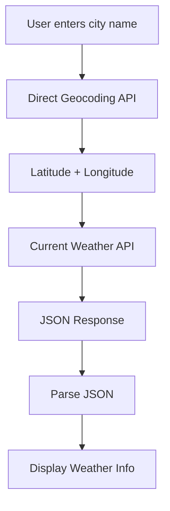

# API Overview — Weather Information Mobile Application

## Project Title

**Weather Information Mobile Application — REST API Integration**

## Purpose

This Android application allows a user to enter a city name and retrieve current weather
information from an external REST API. The retrieved data is displayed on the device screen.

This document serves as the API documentation package for the practical exercise, covering
API selection, architecture, request flow, and assignment requirement mapping.

---

## Selected API

**OpenWeather** — [https://openweathermap.org](https://openweathermap.org)

OpenWeather provides global weather data through a set of RESTful APIs that return data
in JSON format via standard HTTP GET requests.

### Why OpenWeather Was Selected

| Criteria                     | OpenWeather                                                |
| ---------------------------- | ---------------------------------------------------------- |
| REST API                     | Yes — standard RESTful endpoints                           |
| HTTP GET support             | Yes — all data retrieval uses GET                          |
| JSON response format         | Yes — default response format is JSON                      |
| Free tier available          | Yes — provides access to required endpoints                |
| Comprehensive documentation  | Yes — official docs with examples and field descriptions   |
| Supports city-based search   | Yes — via Direct Geocoding API                             |
| Returns required fields      | Yes — temperature, humidity, wind speed, weather condition |

---

## APIs Used

This project uses **two** OpenWeather APIs in sequence:

| #  | API Name                  | Purpose                                      | Documentation                                                                 |
| -- | ------------------------- | -------------------------------------------- | ----------------------------------------------------------------------------- |
| 1  | Direct Geocoding API      | Convert city name → latitude + longitude     | [Official Docs](https://openweathermap.org/api/geocoding-api)                 |
| 2  | Current Weather Data API  | Retrieve weather data using lat/lon          | [Official Docs](https://openweathermap.org/current)                           |

---

## Overall Architecture

The application follows a **two-step API call** pattern:

1. **Step 1 — Geocoding:** The user's city name is sent to the Direct Geocoding API,
   which returns the geographic coordinates (latitude and longitude) for that city.

2. **Step 2 — Weather Data:** The coordinates from Step 1 are used to call the
   Current Weather Data API, which returns the actual weather information in JSON format.

This two-step approach is the method recommended by the official OpenWeather documentation
for retrieving weather data by city name.

---

## Application Request Flow



### Flow Description

```text
User enters city name (e.g., "Colombo")
        ↓
App sends HTTP GET to Direct Geocoding API
   Endpoint: http://api.openweathermap.org/geo/1.0/direct
   Parameters: q=Colombo,LK&limit=1&appid=YOUR_API_KEY
        ↓
API returns latitude and longitude
   Example: lat=6.9344, lon=79.8428
        ↓
App sends HTTP GET to Current Weather API
   Endpoint: https://api.openweathermap.org/data/2.5/weather
   Parameters: lat=6.9344&lon=79.8428&units=metric&appid=YOUR_API_KEY
        ↓
API returns JSON response with weather data
        ↓
App parses JSON to extract:
   • City Name        → name
   • Temperature      → main.temp
   • Weather Condition → weather[0].description
   • Humidity          → main.humidity
   • Wind Speed        → wind.speed
        ↓
App displays information on screen
```

---

## Relationship Between APIs

```text
Direct Geocoding API          Current Weather API
┌─────────────────────┐       ┌──────────────────────────┐
│ Input:  City name   │       │ Input:  lat, lon         │
│ Output: lat, lon    │──────▶│ Output: Weather JSON     │
└─────────────────────┘       └──────────────────────────┘
```

The **Direct Geocoding API** acts as a lookup service. It does not return weather data.
Its sole purpose in this application is to translate a human-readable city name into
geographic coordinates that the **Current Weather API** requires as input.

---

## Assignment Requirements Satisfied

| Practical Requirement           | How It Is Satisfied                                          |
| ------------------------------- | ------------------------------------------------------------ |
| REST API                        | OpenWeather provides RESTful endpoints                       |
| HTTP GET method                 | Both APIs use HTTP GET requests                              |
| JSON response                   | Both APIs return JSON by default                             |
| JSON parsing                    | App parses JSON to extract required fields                   |
| Dynamic API data                | Weather data is live and changes with real conditions         |
| City search                     | User enters city name → Geocoding API resolves coordinates   |
| Error handling                  | App handles network errors and invalid city responses        |
| Postman API testing             | Both APIs tested in Postman (see `05-postman-testing.md`)    |

---

## Required Display Fields

The practical sheet requires the application to display:

| Field             | Source API            | JSON Path                    |
| ----------------- | --------------------- | ---------------------------- |
| City Name         | Current Weather API   | `name`                       |
| Temperature       | Current Weather API   | `main.temp`                  |
| Weather Condition | Current Weather API   | `weather[0].description`     |
| Humidity          | Current Weather API   | `main.humidity`              |
| Wind Speed        | Current Weather API   | `wind.speed`                 |

> Detailed JSON response analysis is in [`04-json-response-structure.md`](./04-json-response-structure.md).

---

## Security Note

> ⚠️ **API Key Security:** The OpenWeather API key (`appid`) is a private credential.
> It must not be committed to public repositories, shared in screenshots, or hardcoded
> in client-side code without appropriate protection. In all documentation examples,
> the key is replaced with `YOUR_API_KEY`.

---

## Documentation Index

| File                                                                       | Contents                              |
| -------------------------------------------------------------------------- | ------------------------------------- |
| [`01-api-overview.md`](./01-api-overview.md)                               | This file — project overview          |
| [`02-direct-geocoding-api.md`](./02-direct-geocoding-api.md)               | Geocoding API documentation           |
| [`03-current-weather-api.md`](./03-current-weather-api.md)                 | Current Weather API documentation     |
| [`04-json-response-structure.md`](./04-json-response-structure.md)         | JSON field mapping and analysis       |
| [`05-postman-testing.md`](./05-postman-testing.md)                         | Postman testing procedure and results |
| [`06-android-integration-reference.md`](./06-android-integration-reference.md) | Android/Kotlin integration guide  |
