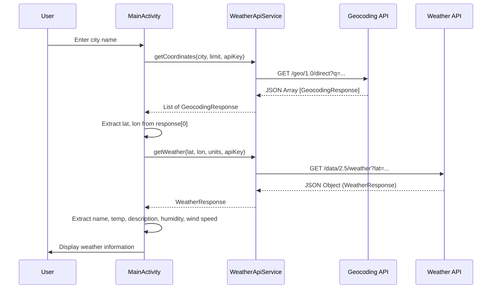

# Android Integration Reference

This document provides a technical reference for integrating the OpenWeather APIs
into the Android application using **Kotlin** and **Retrofit**.

This reference is for **Member A — API & Backend Integration**.

> **Note:** This document describes the conceptual architecture and file responsibilities.
> It does not contain implementation code. Code will be written during the development
> phase using this document as a reference.

---

## Expected File Structure

```text
app/src/main/java/com/example/weatherapp/
├── api/
│   ├── WeatherApiService.kt       ← API interface (Retrofit)
│   └── RetrofitClient.kt          ← Retrofit instance configuration
├── model/
│   ├── GeocodingResponse.kt       ← Data class for Geocoding JSON
│   └── WeatherResponse.kt         ← Data class for Weather JSON
└── MainActivity.kt                ← UI and orchestration
```

---

## Conceptual Architecture

```text
MainActivity
     │
     │ User enters city name
     ↓
WeatherApiService
     │
     │ HTTP GET → Geocoding API
     ↓
GeocodingResponse
     │
     │ Extract lat, lon
     ↓
WeatherApiService
     │
     │ HTTP GET → Current Weather API
     ↓
WeatherResponse
     │
     │ Extract name, temp, description, humidity, wind speed
     ↓
MainActivity
     │
     │ Update UI
     ↓
    UI
```

---

## File Responsibilities

### 1. `WeatherApiService.kt` — API Interface

**Purpose:** Defines the HTTP endpoints as Kotlin interface methods using Retrofit
annotations.

**Responsibilities:**
- Define a GET method for the Direct Geocoding API endpoint
- Define a GET method for the Current Weather API endpoint
- Specify query parameters using Retrofit `@Query` annotations
- Return types should match the expected response structure

**API Documentation Reference:**

| Method         | HTTP  | Endpoint Path                  | Parameters                      | Returns                    |
| -------------- | ----- | ------------------------------ | ------------------------------- | -------------------------- |
| Geocoding      | GET   | `/geo/1.0/direct`              | `q`, `limit`, `appid`          | `List<GeocodingResponse>`  |
| Current Weather| GET   | `/data/2.5/weather`            | `lat`, `lon`, `units`, `appid` | `WeatherResponse`          |

**Key Design Notes:**
- The Geocoding API returns a **JSON array**, so the return type is `List<GeocodingResponse>`
- The Current Weather API returns a **JSON object**, so the return type is `WeatherResponse`
- Both endpoints share the same base URL: `https://api.openweathermap.org`
  - Note: The Geocoding API documentation shows `http://` but `https://` works and is preferred

---

### 2. `RetrofitClient.kt` — Retrofit Configuration

**Purpose:** Creates and configures the Retrofit instance that handles HTTP communication.

**Responsibilities:**
- Set the base URL for OpenWeather API
- Configure JSON converter (Gson)
- Create a singleton Retrofit instance
- Provide a method to get the `WeatherApiService` implementation

**Configuration Reference:**

| Property       | Value                                      |
| -------------- | ------------------------------------------ |
| Base URL       | `https://api.openweathermap.org/`          |
| Converter      | Gson (for JSON parsing)                    |
| Pattern        | Singleton / Object                         |

**Key Design Notes:**
- Use a single Retrofit instance for both API calls (same base URL)
- Gson converter will automatically map JSON fields to Kotlin data class properties

---

### 3. `GeocodingResponse.kt` — Geocoding Data Class

**Purpose:** Kotlin data class that represents one element of the Geocoding API
JSON array response.

**Responsibilities:**
- Map JSON fields from the Geocoding API response to Kotlin properties
- Provide `lat` and `lon` values for the subsequent weather API call

**JSON to Data Class Mapping:**

| JSON Field  | Kotlin Property | Type     | Needed? | Purpose                         |
| ----------- | --------------- | -------- | ------- | ------------------------------- |
| `name`      | `name`          | `String` | Yes     | Confirm resolved city name      |
| `lat`       | `lat`           | `Double` | Yes     | Latitude for weather API call   |
| `lon`       | `lon`           | `Double` | Yes     | Longitude for weather API call  |
| `country`   | `country`       | `String` | Optional| Country code confirmation       |
| `state`     | `state`         | `String?`| Optional| State (may be null)             |

**Key Design Notes:**
- The Geocoding API returns an **array**, so the Retrofit return type is `List<GeocodingResponse>` — this class represents a single item in that list
- The `state` field may not be present for all locations, so it should be nullable (`String?`)
- `local_names` can be omitted from the data class if not needed

---

### 4. `WeatherResponse.kt` — Weather Data Classes

**Purpose:** Kotlin data classes that represent the Current Weather API JSON response.
Because the response contains **nested objects**, multiple data classes are needed.

**Responsibilities:**
- Map the root JSON object to a top-level `WeatherResponse` class
- Map nested `main`, `wind`, and `weather` objects to separate inner classes
- Provide the five required fields for UI display

**JSON to Data Class Mapping — Root Object:**

| JSON Field  | Kotlin Property | Type              | Needed? | Purpose               |
| ----------- | --------------- | ----------------- | ------- | ---------------------- |
| `name`      | `name`          | `String`          | Yes     | City Name (display)    |
| `main`      | `main`          | `Main`            | Yes     | Temperature, Humidity  |
| `weather`   | `weather`       | `List<Weather>`   | Yes     | Weather Condition      |
| `wind`      | `wind`          | `Wind`            | Yes     | Wind Speed             |
| `cod`       | `cod`           | `Int`             | Optional| HTTP status code       |

**JSON to Data Class Mapping — `Main` Object (nested):**

| JSON Field  | Kotlin Property | Type     | Needed? | Purpose            |
| ----------- | --------------- | -------- | ------- | ------------------ |
| `temp`      | `temp`          | `Double` | Yes     | Temperature (°C)   |
| `humidity`  | `humidity`      | `Int`    | Yes     | Humidity (%)       |
| `feels_like`| `feels_like`    | `Double` | Optional| Perceived temp     |
| `pressure`  | `pressure`      | `Int`    | Optional| Pressure (hPa)     |

**JSON to Data Class Mapping — `Weather` Object (nested, inside array):**

| JSON Field    | Kotlin Property | Type     | Needed? | Purpose              |
| ------------- | --------------- | -------- | ------- | -------------------- |
| `description` | `description`   | `String` | Yes     | Weather description  |
| `main`        | `main`          | `String` | Optional| Weather group name   |
| `id`          | `id`            | `Int`    | Optional| Condition code       |
| `icon`        | `icon`          | `String` | Optional| Icon code            |

**JSON to Data Class Mapping — `Wind` Object (nested):**

| JSON Field  | Kotlin Property | Type     | Needed? | Purpose             |
| ----------- | --------------- | -------- | ------- | ------------------- |
| `speed`     | `speed`         | `Double` | Yes     | Wind speed (m/s)    |
| `deg`       | `deg`           | `Int`    | Optional| Wind direction      |

**Key Design Notes:**
- `weather` is a **List** because the JSON field is an array `[ ]`
- To get the description: `weatherResponse.weather[0].description`
- Data classes only need to include fields you plan to use — Gson will ignore
  any JSON fields not mapped to a property
- Property names must match JSON field names exactly, or use `@SerializedName` annotation

---

### 5. `MainActivity.kt` — UI and Orchestration

**Purpose:** Handles user interaction and orchestrates the two-step API call flow.

**Responsibilities:**
- Accept city name input from the user
- Call the Geocoding API via `WeatherApiService`
- Extract `lat` and `lon` from `GeocodingResponse`
- Call the Current Weather API via `WeatherApiService` using extracted coordinates
- Extract display fields from `WeatherResponse`
- Update the UI with weather data
- Handle errors (empty geocoding result, network failure, etc.)

---

## How API Documentation Maps to Kotlin Files

```text
┌─────────────────────────────────┐
│   02-direct-geocoding-api.md    │
│   Endpoint, parameters          │───────▶  WeatherApiService.kt
│   03-current-weather-api.md     │          (API methods + @Query params)
│   Endpoint, parameters          │
└─────────────────────────────────┘

┌─────────────────────────────────┐
│   04-json-response-structure.md │
│   Geocoding JSON fields         │───────▶  GeocodingResponse.kt
│   Weather JSON fields           │───────▶  WeatherResponse.kt
│   Field types and nesting       │          (data class properties)
└─────────────────────────────────┘

┌─────────────────────────────────┐
│   03-current-weather-api.md     │
│   Base URL                      │───────▶  RetrofitClient.kt
│   API key parameter             │          (Retrofit configuration)
└─────────────────────────────────┘
```

---

## Data Flow — Sequence Diagram



---

## Error Handling Reference

| Error Scenario                     | Where to Handle    | How to Detect                              |
| ---------------------------------- | ------------------ | ------------------------------------------ |
| No internet connection             | `MainActivity`     | Network exception / timeout                |
| Invalid city name                  | `MainActivity`     | Geocoding returns empty array `[]`         |
| Invalid API key                    | `MainActivity`     | HTTP 401 response                          |
| Weather API failure                | `MainActivity`     | HTTP error or `cod` ≠ 200                  |
| Null fields in response            | Data classes       | Nullable Kotlin types (`String?`)          |

---

## Required Dependencies

The following dependencies are needed for Retrofit and Gson integration (added to
the module-level `build.gradle` or `build.gradle.kts`):

| Dependency                              | Purpose                          |
| --------------------------------------- | -------------------------------- |
| `com.squareup.retrofit2:retrofit`       | HTTP client                      |
| `com.squareup.retrofit2:converter-gson` | JSON to Kotlin object conversion |
| Internet permission in AndroidManifest  | Allow network requests           |

---

## Security Note

> ⚠️ **API Key Handling in Android:**
>
> - Do not hardcode the API key directly in source code files
> - Consider storing it in `local.properties` or `BuildConfig` fields
> - Never commit the API key to a public Git repository
> - The `appid` parameter should be added to API requests at runtime

---

## Summary — Files and Their Documentation Sources

| Kotlin File               | Documentation Source                          | Key Information Used                   |
| ------------------------- | --------------------------------------------- | -------------------------------------- |
| `WeatherApiService.kt`    | `02-direct-geocoding-api.md`, `03-current-weather-api.md` | Endpoints, HTTP method, parameters |
| `RetrofitClient.kt`       | `03-current-weather-api.md`                   | Base URL, JSON format                  |
| `GeocodingResponse.kt`    | `02-direct-geocoding-api.md`, `04-json-response-structure.md` | Response fields, types          |
| `WeatherResponse.kt`      | `03-current-weather-api.md`, `04-json-response-structure.md` | Response fields, nesting, types |
| `MainActivity.kt`         | `01-api-overview.md`                          | Request flow, error handling           |
